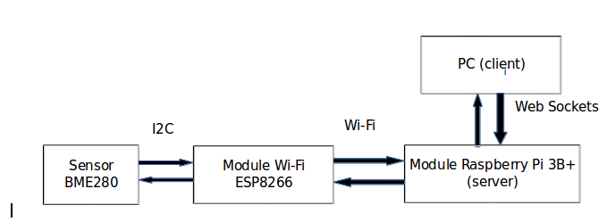

# Report of "Intelligent Measurement Systems" project

#### Developers:

Bartosz Żbikowski 154791

Michał Camacho Romero 157185

#### A) Purpose of the project

Main target of the project was to create a weather system to measure temperature, pressure and humidity in real time.
In order to visualize the measurements, an API, which was able to generate graphs of temperature,
 humidity and pressure, was designed. 
The web application was designed using the programming language Node.js.

#### B) Used modules:

* BME280 I2C temperature, humidity and pressure sensor
* Raspberry Pi 3B+ module
* WIFI module ESP8266 + NodeMCU

#### C) Schematic diagram of the designed system

#### D) Description of the system functionality

In order to read the measurement data, i.e. temperature, humidity, pressure, the BME280 sensor,
 connected via the I2C interface to the ESP8266 Wi-Fi module, is used. 
The ESP8266 module transmits the collected data over a Wi-Fi network to the Raspberry Pi 3B+ microcontroller. 
The Raspberry Pi acts as a web application server to visualize the collected measurement samples in the form of line graphs. 
Communication between the server and the client located on the computer takes place via HTTP protocol.
 In order to collect the collected data, the MongoDB database, placed in the memory of the microcontroller, was used.

In the prepared web application 2 types of requests are used for data transmission:
 GET (visualization of graphs based on measured data) and POST (transmission of measurement data from the client 
 (WiFi module) to the server (Raspberry Pi). The Wifi module transmits data to the server at a frequency of 1 sample per second.
  Additionally, with each received data, on the client side, samples are checked and deleted if they are older than 60 seconds.

#### E) Project results

Achieved goals:

* configuration of communication on the I2C interface, between the sensor and the Wifi module,
* configuration of wireless communication between the WiFi Module and the Raspberry Pi microcontroller,
* carrying out a correct writing and reading from the database on the server,
* implementation of possibility of generating measurement charts through the created API,
* creating the server-client structure in the form of RestAPI.
